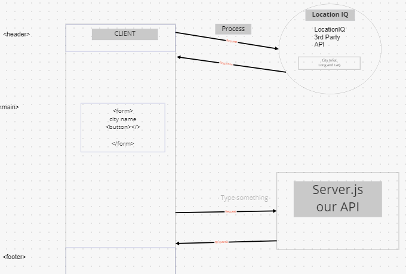
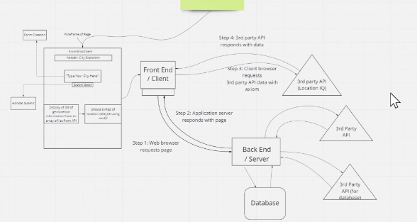
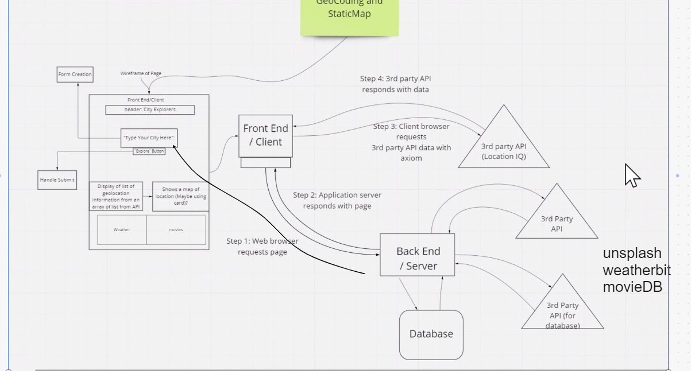

# Project Name

**Author**: Tim Traylor
**Version**: 1.0.0 (increment the patch/fix version number if you make more commits past your first submission)

## Overview
Providing the exact location on demand is a luxary of some people but not all! Here, you can input data and be given a map of that location. Anywhere.
Also the website will return a few days worth of weather.

## Getting Started
<!-- What are the steps that a user must take in order to build this app on their own machine and get it running? -->

## Architecture
<!-- Provide a detailed description of the application design. What technologies (languages, libraries, etc) you're using, and any other relevant design information. -->

## Change Log
<!-- Use this area to document the iterative changes made to your application as each feature is successfully implemented. Use time stamps. Here's an example:

01-01-2001 4:59pm - Application now has a fully-functional express server, with a GET route for the location resource. -->

## Credit and Collaborations
<!-- Give credit (and a link) to other people or resources that helped you build this application. -->

* Lab06 - Jun and Daniel S.
  * 
* Lab07 - Armen
  * 
* Lab08 - Adrian
  * 

Name of feature: City Name, Long and Lat data
Estimate of time needed to complete: 60 min
Start time: 1430
Finish time: 1630
Actual time needed to complete: 120 min

Name of feature: Static Map for location
Estimate of time needed to complete: 90 min
Start time: xxx
Finish time: xxx
Actual time needed to complete: 180 min

Name of feature: Weather data to populate from backend
Estimate of time needed to complete: 2hr
Start time: 1500
Finish time: 2000
Actual time needed to complete: 5 hours

Name of feature: Modulaize Front and Back
Estimate of time needed to complete: 3 hrs
Start time: 1200
Finish time: 1630
Actual time needed to complete: 4.5 hr

<!-- Name of feature: 
Estimate of time needed to complete: 
Start time: 
Finish time: 
Actual time needed to complete:  -->

<!-- Name of feature: 
Estimate of time needed to complete: 
Start time: 
Finish time: 
Actual time needed to complete:  -->